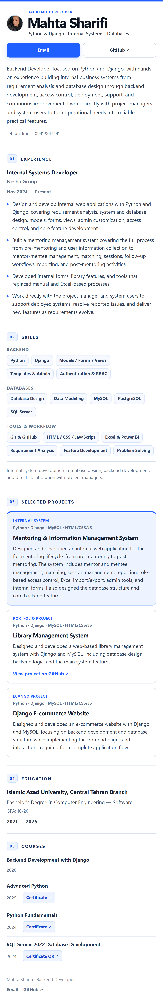

# Mahta Sharifi — Backend Developer Portfolio

A clean, responsive Django portfolio presenting backend development experience, selected projects, technical skills, education, and courses.

## Highlights

- Responsive one-page layout
- Built with Django templates and local CSS only
- No CDN, external font, icon library, or frontend framework dependency
- Compact desktop layout with a focused mobile experience
- Accessible semantic HTML and keyboard focus states

## Tech Stack

- Python
- Django
- HTML
- CSS

## Run Locally

```bash
python -m venv .venv
```

Activate the virtual environment, then run:

```bash
pip install -r requirements.txt
python manage.py migrate
python manage.py runserver
```

Open `http://127.0.0.1:8000/`.

## Contact

- GitHub: `github.com/mahtasharifi`
- Email: `mahtasharifi45@gmail.com`

## Preview

### Mobile

